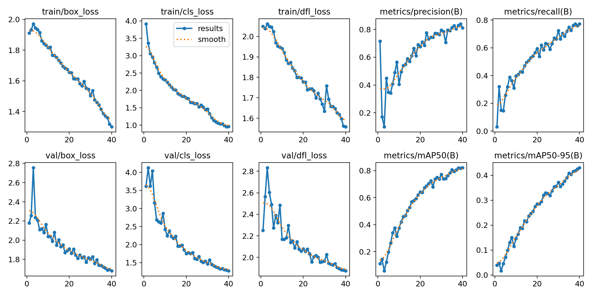
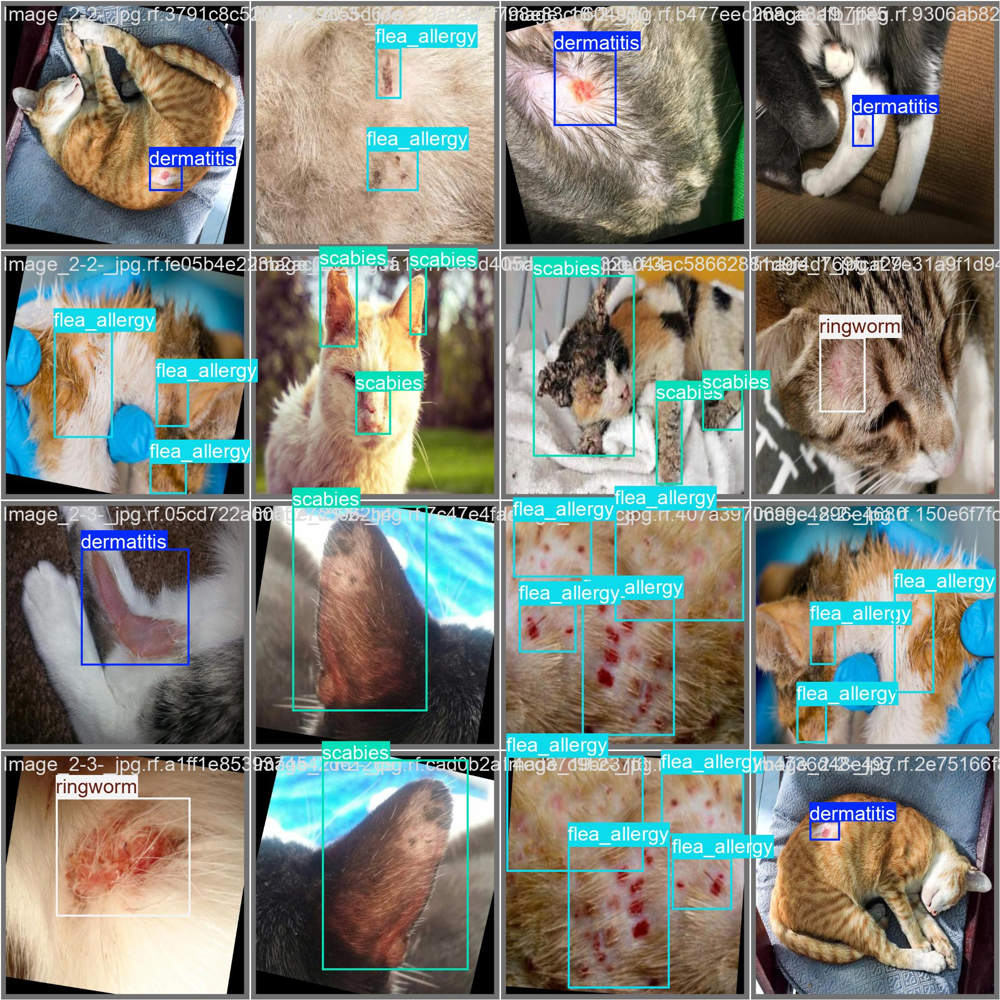

# Cat Skin Disease Detection with YOLOv11 (TensorFlow Lite for Android)

> **Optimized for mobile inference on Android devices using TensorFlow Lite + GPU Delegate**  
> Built for real-time, offline detection of feline skin conditions — no cloud required.

---

## 📚 Dataset

Trained and evaluated using the **Cat Skin Disease** dataset from Roboflow:  
🔗 [click here](https://universe.roboflow.com/maria-angelica-krgdu/skin-disease-of-cat)
Link to training notebook:
🔗 [training notebook here](https://colab.research.google.com/drive/1ZXel1a7cSHi875GyyTxr_v-MhQ3-tsYn?usp=sharing)
- **668 images** across 5 classes:  
dermatitis, flea_allergy, ringworm, scabies
- **Split**: 75% train / 25% val / 5% test  
- **Resolution**: 640×640  

---

## 🧠 Model Training

- **Framework**: YOLOv11 (Ultralytics)  
- **Hardware**: T4 GPU via Google colab
- **Epochs**: 40 | **Batch**: 16 | **Image Size**: 640×640  
- **Optimizer**: AdamW

yolo train model=yolov11n.pt data=cat-skin-disease.yaml epochs=150 imgsz=640 batch=16 optimizer=AdamW

# Training results

# Prediction labels (testing)

